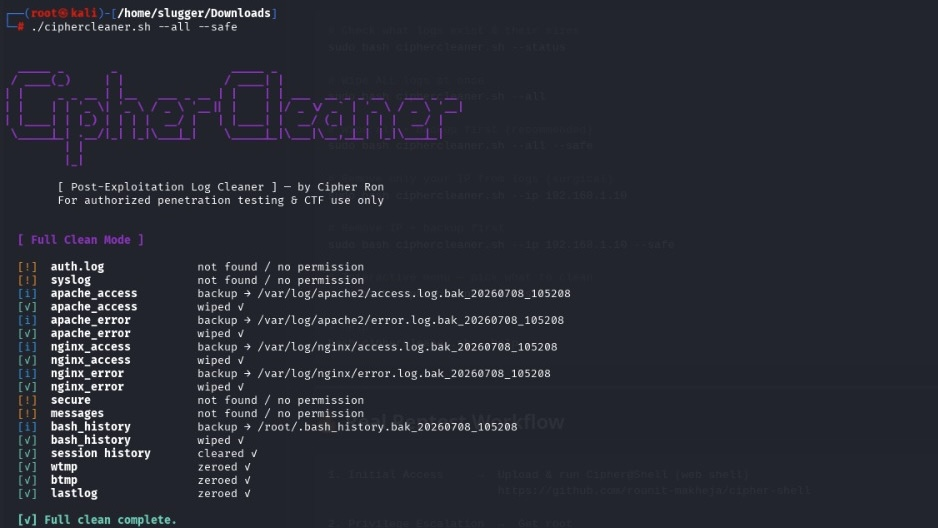

<div align="center">

```
  _____ _       _                 _____ _                              
 / ____(_)     | |               / ____| |                             
| |     _ _ __ | |__   ___ _ __ | |    | | ___  __ _ _ __   ___ _ __ 
| |    | | '_ \| '_ \ / _ \ '__|| |    | |/ _ \/ _` | '_ \ / _ \ '__|
| |____| | |_) | | | |  __/ |   | |____| |  __/ (_| | | | |  __/ |   
 \_____|_| .__/|_| |_|\___|_|    \_____|_|\___|\_,_|_| |_|\___|_|   
         | |                                                           
         |_|                                                           
```

### 🧹 A zero-dependency bash log cleaner for post-exploitation & authorized red team ops


---

[](https://www.linkedin.com/in/rounit-makheja-1a9422323/)
[](https://www.instagram.com/cipher3ron/)
[](https://github.com/rounit-makheja)

</div>

---

## 💀 What is CipherCleaner?

**CipherCleaner** is a single-file bash script that wipes your traces off a compromised Linux server after a pentest or CTF — auth logs, web server logs, bash history, binary logs, all of it.

No Python. No dependencies. **Just bash — works on every Linux, always.**

> ⚠️ **Disclaimer:** This tool is intended **strictly** for authorized penetration testing, CTF competitions, and educational purposes on systems you own or have explicit written permission to test. Unauthorized use is illegal.

---

## 🖥️ Preview




---

## ✨ Features

| Feature | Description |
|--------|-------------|
| 🔥 **Zero Dependencies** | Pure bash — no Python, no pip, no installs |
| 🧹 **Full Wipe Mode** | Nuke all logs in one command |
| 🎯 **IP Filter Mode** | Remove only your IP's entries — surgical & clean |
| 🖱️ **Interactive Mode** | Pick exactly which logs to clean via menu |
| 📊 **Status Mode** | See all log sizes & permissions before touching anything |
| 💾 **Safe Mode** | Auto-backup before wiping — never lose data accidentally |
| 💀 **Binary Log Zeroing** | Handles `wtmp`, `btmp`, `lastlog` — cleans `last` command output |
| 🕵️ **Session History Clear** | Wipes `~/.bash_history` + clears live session history |

---

## 🗂️ Logs Targeted

```
/var/log/auth.log          → SSH & sudo login attempts
/var/log/syslog            → General system events
/var/log/apache2/access.log → Apache web requests
/var/log/apache2/error.log  → Apache errors
/var/log/nginx/access.log   → Nginx web requests
/var/log/nginx/error.log    → Nginx errors
/var/log/wtmp              → Login history (last command)
/var/log/btmp              → Failed login history
/var/log/lastlog           → Last login per user
/var/log/secure            → Auth log (RHEL/CentOS)
/var/log/messages          → System log (RHEL/CentOS)
~/.bash_history            → Bash command history
```

---

## 🚀 How to Download & Use

### Step 1 — Download

**Via Git:**
```bash
git clone https://github.com/rounit-makheja/cipher-cleaner
cd cipher-cleaner
```

**Or direct download:**
```bash
wget https://raw.githubusercontent.com/rounit-makheja/cipher-cleaner/main/ciphercleaner.sh
```

**Or via curl:**
```bash
curl -O https://raw.githubusercontent.com/rounit-makheja/cipher-cleaner/main/ciphercleaner.sh
```

### Step 2 — Give Execute Permission

```bash
chmod +x ciphercleaner.sh
```

### Step 3 — Run It

```bash
sudo bash ciphercleaner.sh --status       # check logs first
sudo bash ciphercleaner.sh --all          # wipe everything
sudo bash ciphercleaner.sh --all --safe   # wipe with backup
```

---

## 📖 All Commands

```bash
# Check what logs exist & their sizes
sudo bash ciphercleaner.sh --status

# Wipe ALL logs at once
sudo bash ciphercleaner.sh --all

# Wipe all + backup first (recommended)
sudo bash ciphercleaner.sh --all --safe

# Remove only your IP from logs (surgical)
sudo bash ciphercleaner.sh --ip 192.168.1.10

# Remove IP + backup first
sudo bash ciphercleaner.sh --ip 192.168.1.10 --safe

# Interactive menu — pick what to clean
sudo bash ciphercleaner.sh --select

# Help
bash ciphercleaner.sh --help
```

---

## 🔥 Real Pentest Workflow

```
1. Initial Access     →  Upload & run Cipher@Shell (web shell)
                         https://github.com/rounit-makheja/cipher-shell

2. Privilege Escalation  →  Get root

3. Post-Exploitation  →  Run your commands, grab data

4. Cleanup            →  Upload & run CipherCleaner
                         sudo bash ciphercleaner.sh --ip YOUR_IP

5. Exit               →  No traces left 👻
```

> 💡 **Pro Tip:** Use `--ip` mode instead of `--all` for stealthier cleanup — wiping entire logs can itself look suspicious to a blue team.

---

## 📁 File Structure

```
cipher-cleaner/
│
├── ciphercleaner.sh    ← The entire tool (single file)
└── README.md           ← You are here
```

---

## 🛡️ Legal Notice

```
This tool is provided for EDUCATIONAL and AUTHORIZED TESTING purposes only.
The author is NOT responsible for any misuse or damage caused by this tool.
Always get written permission before testing any system you don't own.
Unauthorized use may violate local, state, and federal laws.
```

---

<div align="center">

**Made with 🖤 by Cipher Ron**

[](https://www.linkedin.com/in/rounit-makheja-1a9422323/)
[](https://www.instagram.com/cipher3ron/)
[](https://github.com/rounit-makheja)

*If this saved your ass on a CTF, drop a ⭐ on the repo!*

</div>
